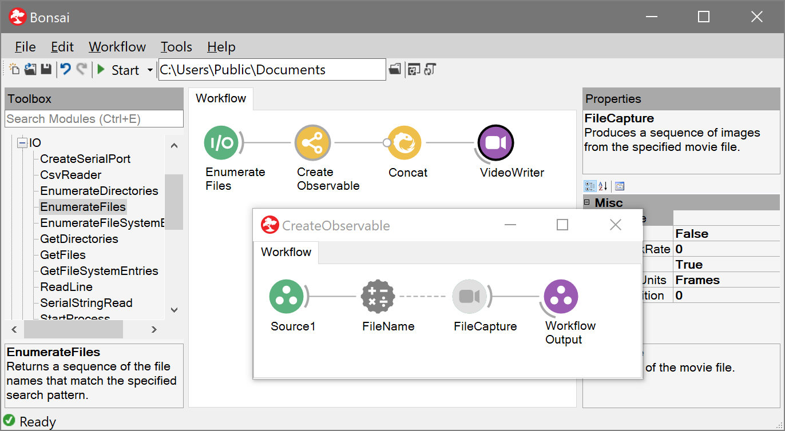

In most cases, when building simple reactive systems, it is enough to place a source for every device or every file you are accessing, as well as a set of transforms, sinks and combinators representing all the operations you need to perform on the data.

However, sometimes you may need to build systems that deal with an unknown number of sources. For example, imagine you wanted to create a workflow to merge together many video files. If you knew beforehand how many files you will need to combine and where they are exactly located, you might use the [`Concat`](/docs/operators/concat) operator to design a workflow like the following:

But what if you did not know beforehand how many video files you will need to combine, and you wanted to merge all these videos without having to manually place a source node for every file?

Suppose all you had to get started was the `EnumerateFiles` source. This operator creates an observable sequence that will emit all the file names in a folder, one after the other.

In order to merge all the frames from these files in a single sequence you would need to create a different `FileCapture` source for every file name emitted by this sequence, and pass all these sources to the `Concat` operator to generate a single sequence of frames. In other words, you want to create a sequence of frames for every file name in the folder, and then combine all these sequences into a single video file.

Whenever an operator receives or emits a sequence of sequences, we call it a higher order operator. These operators play a particularly powerful role in the Bonsai programming language so it is useful to describe them in some detail.

## A metaphor for higher-order operators

The social network metaphor introduced at the beginning of this guide can be extended to describe higher-order operators. If observable sequences are accounts in a social network, and data items are posts published by these accounts, you can describe the video concatenation example in the following steps:

1. Create an account that sends out a post for every file name in the target folder.
2. Follow the account from step 1. For every file name sent out by this account, *create an entirely new account*. Each of these new accounts matches a different file name, and will emit a sequence of posts with every frame in the corresponding video file. The output from this step is the sequence of all these newly created accounts.
3. Create an account that follows this sequence of accounts. When the first account from the sequence is received, follow it and repost all the frames that it sends out. After it terminates naturally, i.e. the file finishes, follow the second account in the sequence and repost all the frames from that account. Repeat for all the accounts in the sequence of accounts.
4. Follow the account from step 3. For every post, save the frame into a file.

In this metaphor, higher-order operators allow you to create accounts from posts, or combine sequences of accounts into posts. In general, any operator that receives or emits a sequence of accounts can be considered a higher-order operator.

## Higher-order operators in the Bonsai visual language

Higher-order operators are represented and used as nodes, just like any other operator. However, some higher-order operators allow you to specify their behaviour by using node groups. This allows you to program how the created sequences behave by reusing existing sources, transforms and other nodes.

For example, the video concatenation workflow can be implemented in Bonsai as follows:

The behaviour of the `WindowWorkflow` operator is specified by the floating node group. Each time a new file name is emitted by the `EnumerateFiles` source, the `WindowWorkflow` operator creates a new observable sequence controlled by the operators inside the group.

The input to the node group -- represented by the `Source1` operator -- is a sequence containing the individual items received by `WindowWorkflow`. In this case, it is a sequence with a single item that returns the file name emitted by the `EnumerateFiles` source. We use an externalized property to assign this value to the `FileName` of the `FileCapture` node, so that the correct video is accessed. Finally, the output of the node group determines the type and timing of the items emitted by the created sequence.

**ProTip:** The `WindowWorkflow` operator creates new sequences for every input notification. However, it does not automatically subscribe to them -- they are latent. No data actually flows through the operators in the node group until some other higher-order operator -- in this case `Concat` -- actually takes these sequences and subscribes to them.
{: .notice--info}

## Marble diagrams for higher-order operators

Marble diagrams can also be extended to describe the behaviour of higher-order operators. Emitted sequences are represented by diagonal timelines branching off the main operator timeline. The start of the branching sequence represents the time at which that sequence was emitted.

For example, the `WindowWorkflow` operator used to convert file names into sequences of video frames is described below:

This marble diagram makes clear that the operator reacts to each file name notification by creating a new observable sequence. In this case, each created sequence will emit all the frames in the specified video. In general, however, this operator can produce all kinds of sequences, determined by the particular combination of operators inside the node group.

Finally, operators can combine sequences of sequences into a single sequence by collecting all the items from each sequence. There are multiple ways to perform this combination. For example, the `Concat` operator subscribes to each emitted sequence one at a time, advancing to the next sequence only when the previous one terminated successfully.

This behaviour is described by the following marble diagram:

