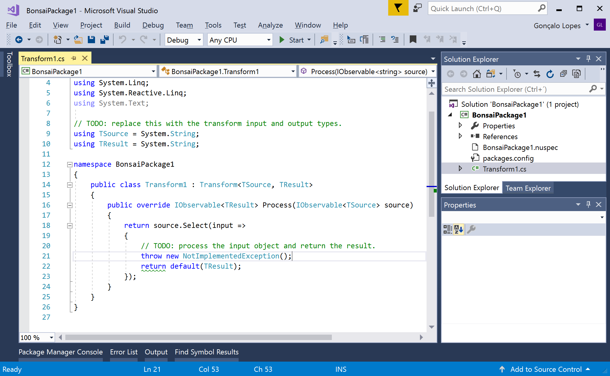
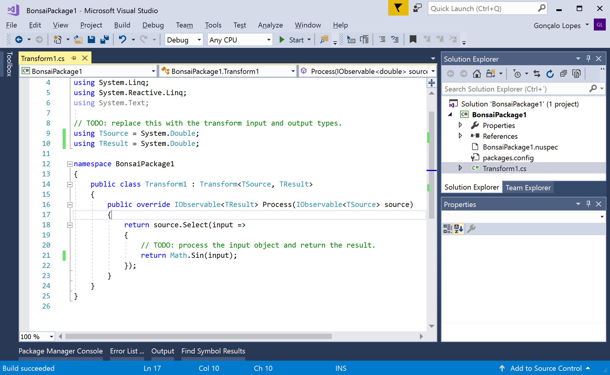
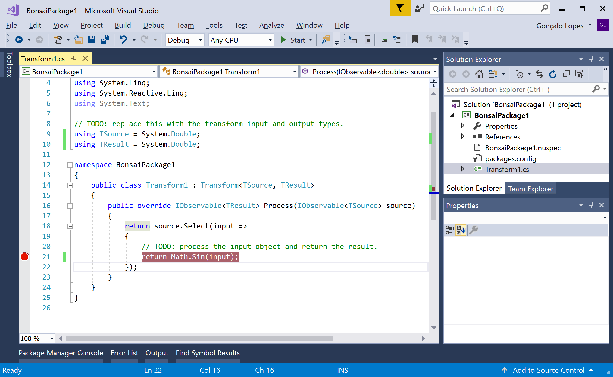
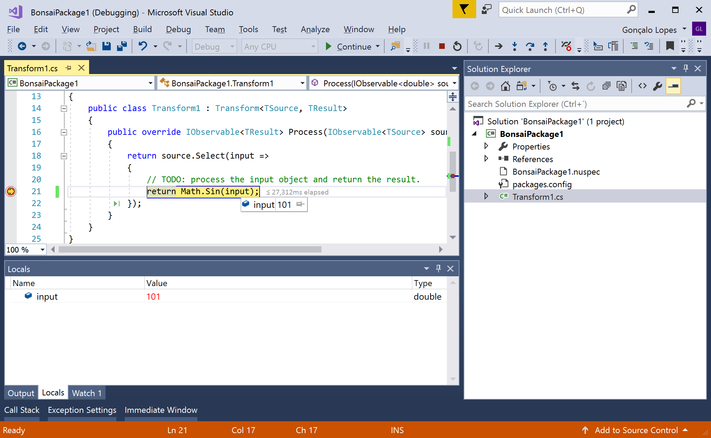

The Bonsai language can be easily extended with custom operators, which are installed and shared using assembly packages. These packages are typically written in the C# programming language, using the [Visual Studio](https://www.visualstudio.com/) development environment.

## Install pre-requisites

1. [Visual Studio](https://www.visualstudio.com/). You can install the Community edition for free.
2. Bonsai VS Extensions. In the Windows Start Menu, search for the "**Install Bonsai VS Extensions**" shortcut and run it.

## Create a package project

1. Start **Visual Studio**.
2. Create a **New Project**. In the **New Project** dialog, there should now be a project template for creating a Bonsai package, under **Templates/Visual C#/Bonsai**. 
3. After the project is created, you should see that a file "**Transform1.cs**" has been created and added to the solution explorer. This file contains an example implementation of a custom transform node. 
4. `TSource` and `TResult` specify the input and output data types of the transform and you can modify them however you want. Every Bonsai node operates on observable sequences using the [ReactiveX](http://reactivex.io/) framework. Transforms are nodes which apply an operation to every item in the input sequence. The simplest way to implement a transform is by using the [`Select`](http://reactivex.io/documentation/operators/map.html) operator from Rx. As an example, we will modify the transform in order to apply a sine operation on numeric inputs. 
5. We can test our transform by starting the project with **F5**. This will automatically launch the Bonsai editor with our package preloaded in the **Toolbox**. Add a `Timer` source and our `Transform1` node. Set the timer period to some reasonable value like 0.1 seconds and run the workflow. 
6. It is also possible to debug our code while it is running by setting breakpoints, either by clicking on the left of the line we want to debug or by hitting **F9** over the target code. After this, you can run the code step by step and inspect the runtime value of variables.  
